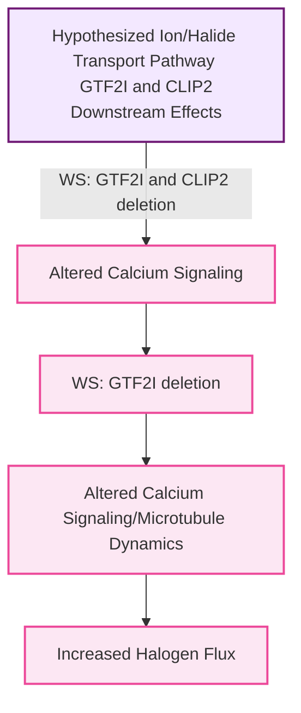

## 🌊 Hypothesis: Epigenomic and Genomic Regulation of Halide and Ion Transport Flux

### Observations and Hypotheses 
Beyond the raw chemical kinetics, I’m curious about how the macro-structural tissue abnormalities characterized by the *GTF2I* deletion might modulate local mass transport. If the extracellular matrix volume fraction is expanded or the tortuosity is lowered in specific regions like the amygdala, it could allow for a significantly higher flux of localized halides. I wonder if this topological framework might create localized microenvironments where bromide can outcompete chloride for peroxidase interactions, despite the stark systemic concentration gradient.

I suspect that structural loci within this region, specifically the microtubule-linker *CLIP2*, dictate the intracellular trafficking and spatial polarization of membrane-bound halide cotransporters. By utilizing computational workflows for DNA methylome and transcriptomic tracking, I hope to map how these synchronized epigenetic shifts alter both the neurochemical and biophysical architecture of social approach behaviors.

### Effect on Downstream Halide Dynamics

While halide transporter genes like *KCC2* do not appear to be deleted in WS, it is proposed that the structural loci within the WS deletion region have a downstream effect on this transport mechanism. For example, *CLIP2* regulates cytoskeleton and microtubule architecture [1](ref#1); it may regulate ion and halide transport within cells. In addition, the deletion of *GTF2I* alters calcium transport, and genes like *KCC2* may be epigenetically downregulated as a result.

### References
1.  Lasser, M., Tiber, J., & Lowery, L. A. (2018). The Role of the Microtubule Cytoskeleton in Neurodevelopmental Disorders. Frontiers in cellular neuroscience, 12, 165. https://doi.org/10.3389/fncel.2018.00165
