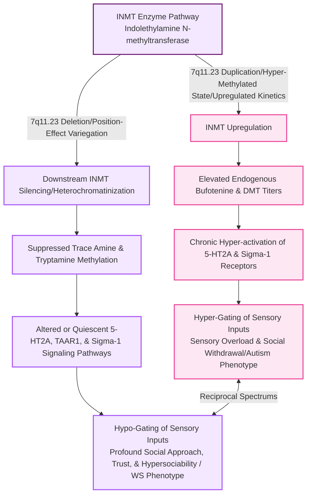

## Hypothesis: Divergent *INMT* and *ASMT* Kinetics in ASD and Williams Syndrome (WS)
I am investigating a reciprocal model of neurodevelopmental and domesticated phenotypes related to trace amine metabolism and structural transport. Based on clinical findings of elevated endogenous bufotenine titers in autistic and schizophrenic cohorts [1](ref#1), I hypothesize that autism may represent a hyper-methylated state driven by upregulated *INMT* kinetics, leading to hyper-gating of sensory inputs. Furthermore, Abouheif, S et al. (2025) indicate *INMT* signaling is related to autism due to its location in the pineal gland [2](#ref2). I want to explore whether *INMT* is downstream-silenced in Williams syndrome via position-effect variegation following the *7.11.23* deletion. Conversely, I also hypothesize that an alternate serotonergic tryptamine pathway, O-methylation of *ASMT*, may be upregulated in WS and downregulated in ASD. This is based on the observation that some of the sensory challenges in ASD and social fear mimic the subjective effects of bufotenine and related methylated tryptamines, whereas the open consitutive social phenotype of WS mirrors serotonergic empathogens.

## Epigenetic Axis
Epigenetic factors also can contribute to tryptamine and phenethylamine methylation. For example, if specific inhibitory feedback elements or regulatory microRNAs that normally keep *INMT* in check undergo epigenetic silencing (hyper-methylation) during early embryogenesis or development, a transcriptonomic upregulation of tryptamine methylation kinetics would result. I am curious about how the Prenatal Sex Steroid (PSS) Theory that posits that individuals on the autism spectrum are exposed to elevated levels of a broad range of steroids in utero fits in to *INMT* signaling. Amphibians such as *Incilius alvarius* produce 5-MeO-DMT as a toxic compound to ward off predators, and bufotenine is is the O-demethylated metabolite of 5-MeO-DMT. I hypothesize that this altered *INMT* signaling may result from steroid or environmental toxin exposure in utero. Furthermore, it is hypothesized that paternal usage of high-dose steroids prior to conception may play a role (e.g., via sperm epigenome remodeling), as I have ASD and none of my parents have it, but my father has Chron's disease and has used steroids chronically for treatment. 

## References
1.  Emanuele, E., Colombo, R., Martinelli, V., Brondino, N., Marini, M., Boso, M., Barale, F., & Politi, P. (2010). Elevated urine levels of bufotenine in patients with autistic spectrum disorders and schizophrenia. *Neuro Endocrinology Letters*, *31*(1), 117-121. [PMID: 20150873](https://pubmed.ncbi.nlm.nih.gov/20150873/)
2.  Abouheif, S., Awad, A., & McCurdy, C. R. (2025). Implications of Indolethylamine N-Methyltransferase (INMT) in Health and Disease: Biological Functions, Disease Associations, Inhibitors, and Analytical Approaches. Brain sciences, 15(9), 935. [https://doi.org/10.3390/brainsci15090935](https://doi.org/10.3390/brainsci15090935)[https://doi.org/10.3390/brainsci15090935)
3.  Schwelm, H. M., Zimmermann, N., Scholl, T., Penner, J., Autret, A., Auwärter, V., & Neukamm, M. A. (2022). Qualitative and quantitative analysis of tryptamines in the poison of *Incilius alvarius* (Amphibia: Bufonidae). *Journal of Analytical Toxicology*, *46*(5), 540–548. [https://doi.org/10.1093/jat/bkab038](https://doi.org/10.1093/jat/bkab038)
